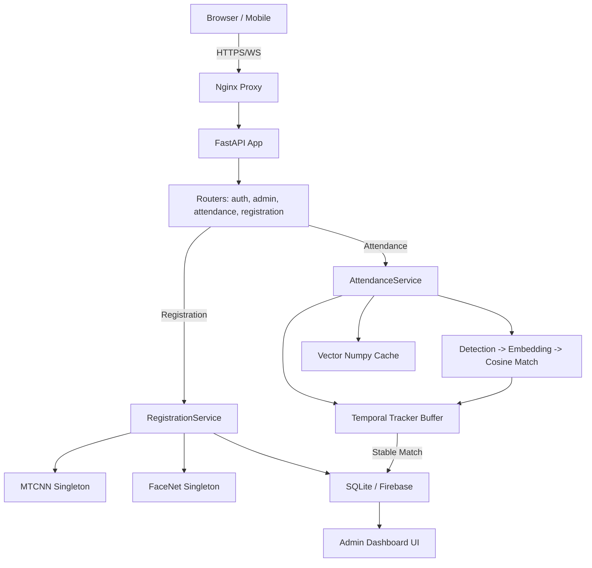

# Current Architecture

## 1. System Components

## 2. Component Roles
- **Frontend**: Vite + React SPA handling user workflows. Directly accesses standard browser APIs (`MediaDevices.getUserMedia`) for frame captures.
- **Routers**: Route layer parsing requests and offloading to services.
- **Services Core**: `session_service.py` manages active session state. `temporal_tracker.py` maintains memory buffer preventing flickering recognitions. `optimized_recognition.py` acts as an in-memory vector cache loaded on session start.
- **AI Models**: Instantiated as singletons via `get_detector()` and `get_facenet_model()` to prevent heavy memory loading times per request.
- **Database**: Layered architecture that smoothly falls back to SQLite (`backend.database.sqlite_service`) from Firebase Firestore (`backend.database.firebase_service`) based on `.env`.

---

# Detailed Flow Trace

## 1. Registration Flow
**From Camera to Database:**
1. **Frontend Capture**: `register.html` / `Register.tsx` invokes `navigator.mediaDevices`.
2. **Batching**: Captures array of images over time, base64 encodes them.
3. **API Call**: `POST /api/v1/registration/register` triggered.
4. **Processing (`registration.py -> register_student`)**: Iterates through base64 array payload.
5. **Detection (`face_detection.py -> detect_single_face`)**: Identifies bounded face tensors through MTCNN. Rejects frames with 0 or >1 face.
6. **Feature Extraction (`embedding_service.py -> generate_average_embedding`)**: Produces averaged 512-D vector from multi-frame FaceNet runs.
7. **Persistence (`sqlite_service.py -> add_student`)**: Vector JSON serialization inserted to table along with metadata (Name, Roll No, Institution).
8. **Cache Refresh**: Calls `get_embedding_cache().refresh()` to make the student recognizable to active instances immediately.

## 2. Real-time Attendance Flow
1. **Start Session**: Admin triggers `POST /api/v1/attendance/session/start`.
2. **Preload Vectors**: Calls `get_embedding_cache().load()`, dragging all DB embeddings into a NumPy Matrix.
3. **Frame Stream**: `LiveMonitor.tsx` streams single base64 frames to `POST /api/v1/attendance/mark-attendance`.
4. **Processing & Optimization**: Router resizes incoming Image buffer to `FRAME_RESIZE_WIDTH` threshold.
5. **Detection**: `detect_faces()` runs MTCNN returning multiple tensors context.
6. **Matching (`optimized_recognition.py -> find_match`)**: FaceNet generation triggers vectorized cosine similarity (`matrix @ embedding`) to find `argmax` distance under `SIMILARITY_THRESHOLD = 0.80`.
7. **Temporal Verification (`temporal_tracker.py -> update`)**: Matches are ingested into tracking buffer (`TrackedFace`). Only when `num_frames >= 4` and avg confidence `>= 0.80` is it promoted to "Mark".
8. **Logging (`sqlite_service.py -> add_attendance`)**: Mark decisions push to Database log preventing duplicates natively by checking cooling periods.
9. **UI Feedback**: API responds with coordinates, frontend renders colored bounding box overlays on `canvas`.
